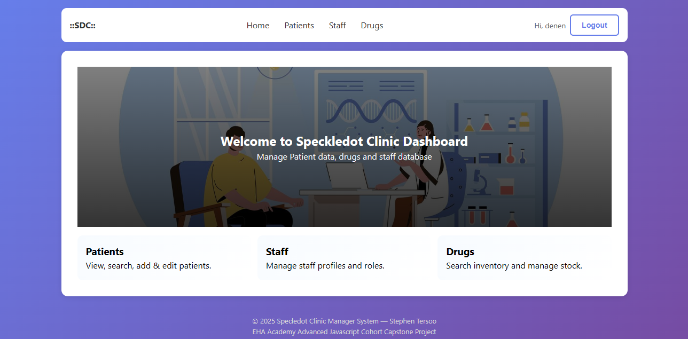

# Patient Data Management System

A modern, frontend-only Single Page Application (SPA) for managing patients, staff and drugs — built with React + TypeScript and using `localStorage` to simulate backend behavior.


## 🔗 Links

-   Live Demo: _(update with your deployment link if any)_

## 📋 Table of Contents

-   [Overview](#overview)
-   [Screenshots](#screenshots)
-   [Features](#features)
-   [Technology Stack](#technology-stack)
-   [Getting Started](#getting-started)
-   [Usage Guide](#usage-guide)
-   [Data Management](#data-management)
-   [Security Considerations](#security-considerations)
-   [Browser Compatibility](#browser-compatibility)
-   [Future Enhancements](#future-enhancements)
-   [Contributing](#contributing)
-   [License](#license)

## 🎯 Overview

This project is a frontend simulation of a Patient Data Management System. It demonstrates typical features you'd expect in a small healthcare admin app:

-   Multi-section navigation (Patients, Staff, Drugs)
-   User authentication (signup/login) with client-side hashing
-   CRUD operations for patients, staff and drugs
-   Local persistent storage via `localStorage`
-   Mobile-responsive UI with a navigation bar and footer
-   Loading indicators and simulated async behavior

This project was built as a capstone / demo and intentionally keeps all logic client-side for simplicity.

## 📸 Screenshots

_(Place screenshots in `src/assets` and update paths below)_

-   Login Page:
    
-   Signup Page:
    
-   Signup Page:
    
-   Patient List Page:
    
-   Patient Details Page:
    

## ✨ Features

### 🔐 Authentication

-   Sign up (password hashed via SHA-256 in the browser)
-   Login with credential verification against a local user store
-   Session persisted in `localStorage`
-   Protected routes (Patients, Staff, Drugs) using React Router

### 🗂 Multi-section Management

-   Patients: create, view, edit, delete. Each patient has appointments, diagnoses, prescriptions, adherence and future appointments.
-   Staff: manage staff profiles and roles.
-   Drugs: manage drug inventory, including stock and manufacturer.

### 🔎 Search

-   Search patients by name or ID.
-   Search for drugs and staff (search inputs scaffolded for expansion).

### 🧭 Navigation & Layout

-   Responsive NavBar (hamburger on mobile)
-   Home page with quick action cards
-   Footer with basic project info

### ⚡ UX

-   Loading indicators for async actions
-   Confirmation dialogs on destructive actions
-   Accessible forms with `label` + `id` pairs

## 🛠 Technology Stack

-   React 18
-   TypeScript 5
-   React Router v6
-   CSS (modular, responsive)
-   LocalStorage (to simulate server persistence)

## 🚀 Getting Started

### Prerequisites

-   Node.js v14+
-   npm or yarn

### Installation

1. Clone repo:

```bash
git clone https://github.com/StivinTaesoo/react-capstone-project.git
cd react-capstone-project
```

2. **Install dependencies**

    ```bash
    npm install
    # or
    yarn install
    ```

3. **Start the development server**

    ```bash
    npm run dev
    # or
    yarn run dev
    ```

4. **Open your browser**
    ```
    Navigate to http://localhost:3000 OR http://localhost:5173
    ```

### First-Time Setup

1. **Create an account**

    - Click "Sign up here" on the login page
    - Enter a unique username
    - Create a strong password
    - Click "Sign Up"

2. **Login**
    - Enter your credentials
    - System automatically fetches initial patient data
    - You'll be redirected to the patient list

## 🔒 Security Considerations

### Current Implementation

⚠️ **Important**: This is a demonstration application with simplified security.

-   **Password Encryption**: Uses Base64 encoding (NOT production-ready)
-   **Session Management**: Simple localStorage tokens
-   **No Backend**: All data stored client-side
-   **No HTTPS**: Relies on browser security

## 🌐 Browser Compatibility

### Supported Browsers

-   ✅ Chrome (v90+)
-   ✅ Firefox (v88+)
-   ✅ Safari (v14+)
-   ✅ Edge (v90+)

### Required Features

-   localStorage API
-   Fetch API
-   ES6+ JavaScript
-   CSS Grid & Flexbox

### Testing

Test the application in different browsers:

```bash
# Chrome
npm run dev


```

## 🔮 Future Enhancements

### Planned Features

-   Add server API (Node/Express) with secure auth
-   Replace simple hashing with bcrypt on the server and use secure cookies/JWT
-   Improve search with debouncing & filters
-   Add real-time updates via WebSockets
-   Add role-based access control & permissions
-   Add pagination and advanced sorting for lists

## 🤝 Contributing

We welcome contributions! Please follow these guidelines:

### Getting Started

1. Fork the repository
2. Create a feature branch (`git checkout -b feature/newFeature`)
3. Commit your changes (`git commit -m 'Add some newFeature'`)
4. Push to the branch (`git push origin feature/newFeature`)
5. Open a Pull Request

### Code Standards

-   Use TypeScript for all new code
-   Follow React best practices
-   Write meaningful commit messages
-   Add comments for complex logic
-   Update documentation

### Pull Request Process

1. Update the README.md with details of changes
2. Update the documentation if needed
3. The PR will be merged once you have approval

## 📄 License

This project is licensed under the MIT License - see the LICENSE file for details.

```
MIT License

Copyright (c) 2024 Patient Management System

Permission is hereby granted, free of charge, to any person obtaining a copy
of this software and associated documentation files (the "Software"), to deal
in the Software without restriction, including without limitation the rights
to use, copy, modify, merge, publish, distribute, sublicense, and/or sell
copies of the Software, and to permit persons to whom the Software is
furnished to do so, subject to the following conditions:

The above copyright notice and this permission notice shall be included in all
copies or substantial portions of the Software.

THE SOFTWARE IS PROVIDED "AS IS", WITHOUT WARRANTY OF ANY KIND, EXPRESS OR
IMPLIED, INCLUDING BUT NOT LIMITED TO THE WARRANTIES OF MERCHANTABILITY,
FITNESS FOR A PARTICULAR PURPOSE AND NONINFRINGEMENT. IN NO EVENT SHALL THE
AUTHORS OR COPYRIGHT HOLDERS BE LIABLE FOR ANY CLAIM, DAMAGES OR OTHER
LIABILITY, WHETHER IN AN ACTION OF CONTRACT, TORT OR OTHERWISE, ARISING FROM,
OUT OF OR IN CONNECTION WITH THE SOFTWARE OR THE USE OR OTHER DEALINGS IN THE
SOFTWARE.
```

## 👥 Authors

-   **Stephen Tersoo** - _Initial work_ - [StivinTaesoo](https://github.com/StivinTaesoo)

## 🙏 Acknowledgments

-   All staff and mentors of EHA Academy
-   JSONPlaceholder for providing free API endpoints
-   React team for the amazing framework
-   TypeScript team for type safety
-   The open-source community

---

**Note**: This is a demonstration project for educational purposes. Do not use in production healthcare environments without proper security implementations and compliance certifications.

Made with ❤️ by Stephen Tersoo.
