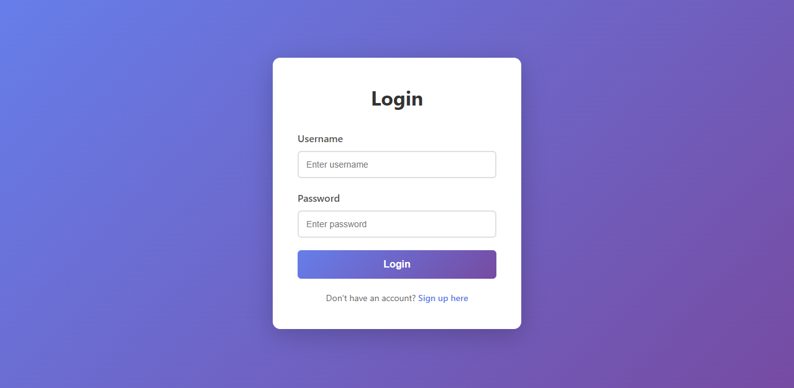
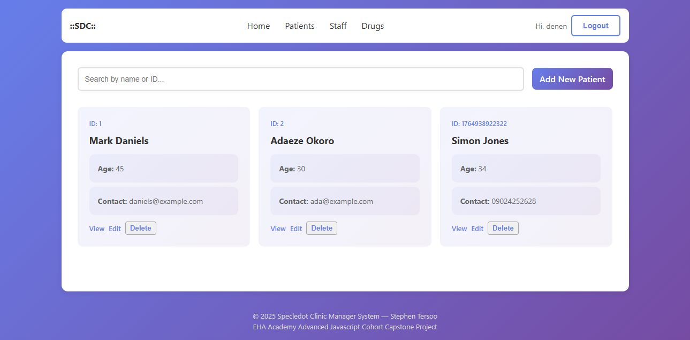
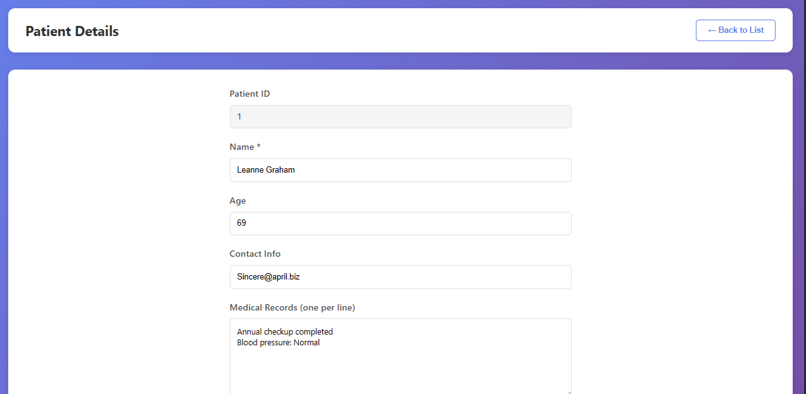

# Patient Data Management System

A modern, fully-functional Single Page Application (SPA) for managing patient data with complete CRUD operations, user authentication, and local data persistence.


## 🔗 Links

-   [Live Demo](https://react-capstone-project-9e7a.vercel.app)

## 📋 Table of Contents

-   [Overview](#overview)
-   [Screenshots](#screenshots)
-   [Features](#features)
-   [Technology Stack](#technology-stack)
-   [Getting Started](#getting-started)
-   [Usage Guide](#usage-guide)
-   [Data Management](#data-management)
-   [Security Considerations](#security-considerations)
-   [Browser Compatibility](#browser-compatibility)
-   [Future Enhancements](#future-enhancements)
-   [Contributing](#contributing)
-   [License](#license)

## 🎯 Overview

The Patient Data Management System is a comprehensive React-based application designed to demonstrate a complete healthcare management workflow. It simulates a real-world medical records system with user authentication, patient data management, and persistent storage—all implemented entirely on the client side.

### Purpose

This project serves as:

-   A showcase of of all I have learnt from the EHA Academy Advanced Javascript Cohort
-   A demonstration of modern React development practices
-   A prototype for healthcare management applications

## 📸 Screenshots

Login Page


Signup Page


Patient List Page


Patient Details Page


## ✨ Features

### 🔐 Authentication System

-   **User Registration**

    -   Unique username validation
    -   Password encryption (Base64 encoding)
    -   Duplicate prevention
    -   Automatic redirect to login

-   **User Login**

    -   Credential verification
    -   Session persistence
    -   Automatic data initialization
    -   Protected route access

-   **Session Management**
    -   Persistent login state
    -   Secure logout
    -   Session storage in localStorage

### 👥 Patient Management

-   **View Patients**

    -   Grid-based card layout
    -   Responsive design
    -   Patient ID and basic info display
    -   Click-to-view details

-   **Search Functionality**

    -   Real-time filtering
    -   Search by name or ID
    -   Case-insensitive matching
    -   Instant results

-   **Add New Patient**

    -   Comprehensive form
    -   Field validation
    -   Unique ID generation
    -   Medical records support

-   **Edit Patient**

    -   Inline editing
    -   Pre-populated forms
    -   Save confirmation
    -   Data validation

-   **Delete Patient**
    -   Confirmation dialog
    -   Safe deletion
    -   Automatic list update
    -   No accidental deletions

### 🎨 User Interface

-   **Modern Design**

    -   Gradient purple theme
    -   Card-based layouts
    -   Smooth animations
    -   Hover effects

-   **Responsive Layout**

    -   Mobile-first approach
    -   Tablet optimization
    -   Desktop enhancement
    -   Flexible grids

-   **User Experience**
    -   Clear visual hierarchy
    -   Intuitive navigation
    -   Loading indicators
    -   Error messages

## 🛠 Technology Stack

### Core Technologies

-   **React 18.x** - UI library with functional components
-   **TypeScript 5.x** - Type-safe JavaScript
-   **CSS3** - Modern styling with gradients and animations

### Key Features Used

-   React Hooks (useState, useEffect, useContext)
-   Context API for state management
-   Custom routing implementation
-   LocalStorage API for data persistence
-   Fetch API for initial data loading

### External APIs

-   **JSONPlaceholder** - Initial patient data
    -   Endpoint: `https://jsonplaceholder.typicode.com/users`
    -   Provides realistic user data
    -   Free and reliable

## 🚀 Getting Started

### Prerequisites

-   Node.js (v14 or higher)
-   npm or yarn
-   Modern web browser with localStorage support

### Installation

1. **Clone the repository**

    ```bash
    git clone https://github.com/StivinTaesoo/react-capstone-project.git
    cd react-capstone-project
    ```

2. **Install dependencies**

    ```bash
    npm install
    # or
    yarn install
    ```

3. **Start the development server**

    ```bash
    npm run dev
    # or
    yarn run dev
    ```

4. **Open your browser**
    ```
    Navigate to http://localhost:3000 OR http://localhost:5173
    ```

### First-Time Setup

1. **Create an account**

    - Click "Sign up here" on the login page
    - Enter a unique username
    - Create a strong password
    - Click "Sign Up"

2. **Login**
    - Enter your credentials
    - System automatically fetches initial patient data
    - You'll be redirected to the patient list

## 📖 Usage Guide

### Authentication Flow

#### Signing Up

```typescript
// Navigate to signup page
1. Enter username (must be unique)
2. Enter password
3. Click "Sign Up"
4. Redirected to login page
```

#### Logging In

```typescript
// Navigate to login page
1. Enter registered username
2. Enter password
3. Click "Login"
4. System fetches patient data
5. Redirected to patient list
```

### Patient Management

#### Viewing Patients

-   All patients displayed in a grid layout
-   Each card shows:
    -   Patient ID
    -   Full name
    -   Age
    -   Contact information
    -   Click prompt

#### Searching Patients

```typescript
// In the search box
1. Type patient name or ID
2. Results filter in real-time
3. Case-insensitive search
4. Clear search to see all
```

#### Adding a Patient

```typescript
// Click "Add New Patient" button
1. Fill in patient details:
   - Name (required)
   - Age
   - Contact Info
   - Medical Records (one per line)
2. Click "Add Patient"
3. System generates unique ID
4. Redirected to patient list
```

#### Editing a Patient

```typescript
// Click on any patient card
1. Patient details load in edit form
2. Modify any field
3. Click "Save Changes"
4. Confirmation shown
5. Return to patient list
```

#### Deleting a Patient

```typescript
// In patient detail view
1. Click "Delete Patient" button
2. Confirmation modal appears
3. Click "Yes, Delete" to confirm
4. Patient removed from system
5. Redirected to patient list
```

### State Management

#### Authentication Context

```typescript
interface AuthContextType {
    isAuthenticated: boolean;
    login: (username: string) => void;
    logout: () => void;
    currentUser: string | null;
}
```

#### Patient Data Structure

```typescript
interface Patient {
    id: number;
    name: string;
    age: number;
    contactInfo: string;
    medicalRecord: string[];
}
```

#### User Data Structure

```typescript
interface User {
    username: string;
    passwordHash: string;
}
```

### Routing Implementation

Custom routing system using React state:

```typescript
type Page = "login" | "signup" | "list" | "detail" | "add";

// Navigation function
const handleNavigate = (page: Page, patientId?: number) => {
    if (patientId) setSelectedPatientId(patientId);
    setCurrentPage(page);
};
```

## 💾 Data Management

### LocalStorage Schema

#### User Storage

```javascript
Key: 'pdm_users'
Value: User[]
Example: [
  {
    username: "stephen_tersoo",
    passwordHash: "Iamthetersoo9obl9kb2U="
  }
]
```

#### Patient Storage

```javascript
Key: 'pdm_patients'
Value: Patient[]
Example: [
  {
    id: 1,
    name: "Mark Daniels",
    age: 45,
    contactInfo: "daniels@example.com",
    medicalRecord: [
      "Annual checkup completed",
      "Blood pressure: Normal"
    ]
  }
]
```

#### Session Storage

```javascript
Key: "pdm_session";
Value: string(username);
Example: "stephen_tersoo";
```

### Data Operations

#### Create

```typescript
const newPatient: Patient = {
    id: Date.now(),
    name: name.trim(),
    age: Number(age) || 0,
    contactInfo: contactInfo.trim(),
    medicalRecord: medicalRecord.split("\n").filter((r) => r.trim()),
};
patients.push(newPatient);
localStorage.setItem("pdm_patients", JSON.stringify(patients));
```

#### Read

```typescript
const patients: Patient[] = JSON.parse(
    localStorage.getItem("pdm_patients") || "[]"
);
```

#### Update

```typescript
const index = patients.findIndex((p) => p.id === patientId);
patients[index] = updatedPatient;
localStorage.setItem("pdm_patients", JSON.stringify(patients));
```

#### Delete

```typescript
const filtered = patients.filter((p) => p.id !== patientId);
localStorage.setItem("pdm_patients", JSON.stringify(filtered));
```

## 🔒 Security Considerations

### Current Implementation

⚠️ **Important**: This is a demonstration application with simplified security.

-   **Password Encryption**: Uses Base64 encoding (NOT production-ready)
-   **Session Management**: Simple localStorage tokens
-   **No Backend**: All data stored client-side
-   **No HTTPS**: Relies on browser security

## 🌐 Browser Compatibility

### Supported Browsers

-   ✅ Chrome (v90+)
-   ✅ Firefox (v88+)
-   ✅ Safari (v14+)
-   ✅ Edge (v90+)

### Required Features

-   localStorage API
-   Fetch API
-   ES6+ JavaScript
-   CSS Grid & Flexbox

### Testing

Test the application in different browsers:

```bash
# Chrome
npm run dev


```

## 🔮 Future Enhancements

### Planned Features

#### Phase 1: Core Improvements

-   [ ] Add appointment scheduling
-   [ ] Implement patient history timeline
-   [ ] Add profile pictures
-   [ ] Export patient data (PDF/CSV)
-   [ ] Print patient records

#### Phase 2: Advanced Features

-   [ ] Backend integration (Node.js/Express)
-   [ ] Database persistence (PostgreSQL/MongoDB)
-   [ ] Real-time updates (WebSocket)
-   [ ] Advanced search filters
-   [ ] Bulk operations

## 🤝 Contributing

We welcome contributions! Please follow these guidelines:

### Getting Started

1. Fork the repository
2. Create a feature branch (`git checkout -b feature/newFeature`)
3. Commit your changes (`git commit -m 'Add some newFeature'`)
4. Push to the branch (`git push origin feature/newFeature`)
5. Open a Pull Request

### Code Standards

-   Use TypeScript for all new code
-   Follow React best practices
-   Write meaningful commit messages
-   Add comments for complex logic
-   Update documentation

### Pull Request Process

1. Update the README.md with details of changes
2. Update the documentation if needed
3. The PR will be merged once you have approval

## 📄 License

This project is licensed under the MIT License - see the LICENSE file for details.

```
MIT License

Copyright (c) 2024 Patient Management System

Permission is hereby granted, free of charge, to any person obtaining a copy
of this software and associated documentation files (the "Software"), to deal
in the Software without restriction, including without limitation the rights
to use, copy, modify, merge, publish, distribute, sublicense, and/or sell
copies of the Software, and to permit persons to whom the Software is
furnished to do so, subject to the following conditions:

The above copyright notice and this permission notice shall be included in all
copies or substantial portions of the Software.

THE SOFTWARE IS PROVIDED "AS IS", WITHOUT WARRANTY OF ANY KIND, EXPRESS OR
IMPLIED, INCLUDING BUT NOT LIMITED TO THE WARRANTIES OF MERCHANTABILITY,
FITNESS FOR A PARTICULAR PURPOSE AND NONINFRINGEMENT. IN NO EVENT SHALL THE
AUTHORS OR COPYRIGHT HOLDERS BE LIABLE FOR ANY CLAIM, DAMAGES OR OTHER
LIABILITY, WHETHER IN AN ACTION OF CONTRACT, TORT OR OTHERWISE, ARISING FROM,
OUT OF OR IN CONNECTION WITH THE SOFTWARE OR THE USE OR OTHER DEALINGS IN THE
SOFTWARE.
```

## 👥 Authors

-   **Stephen Tersoo** - _Initial work_ - [StivinTaesoo](https://github.com/StivinTaesoo)

## 🙏 Acknowledgments

-   All staff and mentors of EHA Academy
-   JSONPlaceholder for providing free API endpoints
-   React team for the amazing framework
-   TypeScript team for type safety
-   The open-source community

---

**Note**: This is a demonstration project for educational purposes. Do not use in production healthcare environments without proper security implementations and compliance certifications.

Made with ❤️ by Stephen Tersoo.
